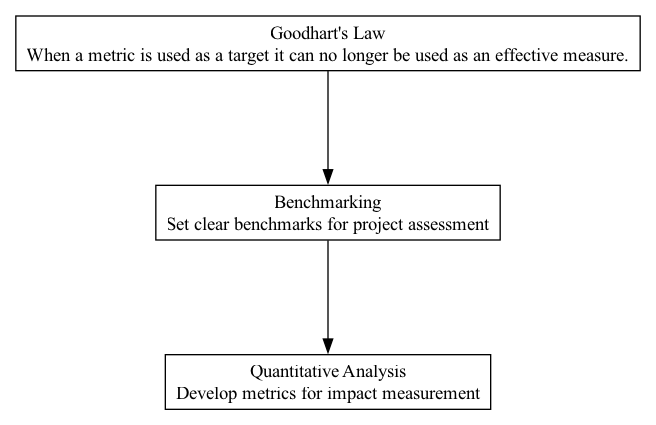

## BKM - Benchmarking

### Supports:

[Quantitative Analysis](./quantitative_analysis.html)

### Context:

In the dynamic and decentralized nature of DAOs, where numerous initiatives and projects are continuously proposed and executed, there is a critical need for a systematic approach to assess progress and performance against predefined criteria or standards.

### Problem:

Without a coherent framework to gauge performance and track progress, DAOs risk inefficient resource allocation, missed deadlines, and projects that drift from their initial objectives, which can lead to suboptimal outcomes and decreased trust among members.

### Forces:

- **Accountability**: Members and stakeholders seek reassurance that resources are being used efficiently towards achieving the DAO’s objectives.
- **Transparency**: Essential for fostering trust and active participation from the community.
- **Adaptability**: Projects may evolve, and benchmarks need to be flexible to accommodate shifting goals and environments.
- **Objectivity**: Measures of success must be clear and agreed upon to prevent conflicts and bias in assessments.

### Solution:

Establish a clear benchmarking system that defines specific, measurable, achievable, relevant, and time-bound (SMART) goals for each project or initiative at the outset. This system should include:
- **Goal Specification**: Clearly articulate what success looks like for each initiative, including key performance indicators (KPIs).
- **Regular Monitoring**: Set up periodic reviews of progress against these benchmarks. This could be facilitated through automated tracking systems on blockchain that provide transparent and immutable records of progress.
- **Adjustments and Iterations**: Based on measured performance, benchmarks can be adjusted to better align with the evolving context of the project or ambient conditions in the DAO.
- **Feedback Integration**: Incorporate feedback mechanisms that allow stakeholders to comment on and contribute to the refinement of benchmarks.

### Real-World Examples and Case Studies:

1. **Gitcoin DAO**: Uses KPIs to measure the success of funded grants and community initiatives. They regularly publish reports showing progress against these KPIs, which helps in keeping the community engaged and informed.
  
2. **MakerDAO**: Implements a Risk Management framework that includes performance metrics for each vault type. These metrics are used to adjust their strategies in lending and stability fee decisions.

3. **Compound Protocol**: Uses benchmarks related to market liquidity and protocol utilization to gauge the performance of their autonomous interest rate models, adapting them as necessary based on real-time data inputs.

### Therefore:

Implement benchmark systems that not only track progress and efficiency but are adaptable and integrated within the DAO's feedback loops, ensuring that benchmarks foster continuous improvement and accountability.

### Supported By:

[Goodhart's Law](./goodharts_law.html)

