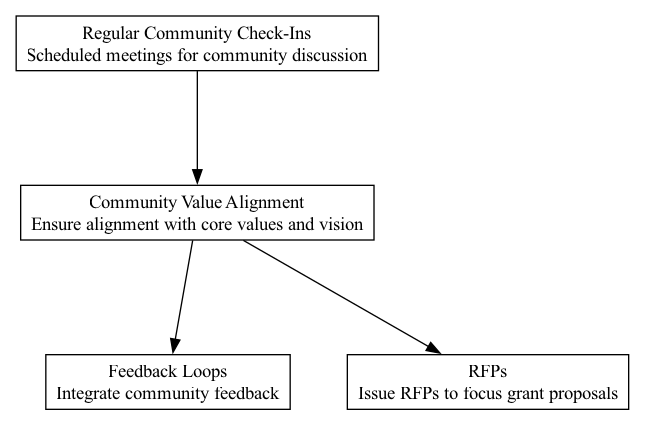

## CVA - Community Value Alignment

### Supports:
[Feedback Loops](./feedback_loops.html), [RFPs](./rfps.html)

### Context:
DAOs operate in dynamic ecosystems where ensuring that projects and investments mirror community ethos and strategic goals is crucial for maintaining trust, participation, and relevance.

### Problem:
There can be misalignment between the decisions made at various levels of the DAO and the community's values and long-term vision. This can lead to suboptimal utilization of resources, reduced community engagement, and potential deviations from the DAO's mission.

### Forces:
- **Community Trust**: Essential for sustained engagement and growth.
- **Strategic Direction**: Needs to be clear and consistently applied.
- **Resource Allocation**: Must be directed towards initiatives that reflect community values.
- **Transparency vs. Autonomy**: Balancing openness with effective management.

### Solution:
Establish frameworks and operational models that ensure all internal projects and external investments align with the core values and long-term vision of the DAO. This involves setting explicit criteria for project acceptance and funding, based on value alignment. It should also include regular reviews and community consultations to ensure that ongoing projects continue to reflect these values. Tools such as decentralized voting, transparent discussions, and value alignment checklists should be used to guide and validate decisions.

**Real-World Examples Supporting the Solution:**
1. **MakerDAO Stability Fee Adjustments**: The process of adjusting stability fees within MakerDAO involved community voting, reflecting the community's values on maintaining DAI's peg and financial stability. This process showcased how DAOs could align operational decisions with community inputs effectively.
2. **Ethereum EIP-1559 Implementation**: The inclusion of EIP-1559, a significant change in Ethereum's fee market, was influenced by extensive community discussion and feedback. It aimed to align transaction fee mechanics with the long-term expectation of network users, addressing concerns over transaction predictability and network security.

### Therefore:
Regularly integrate community input to ensure alignment with core values, and adjust strategies and projects to reflect evolving community sentiments and ethical standards.

### Supported By:
[Regular Community Check-Ins](./regular_community_check_ins.html)

