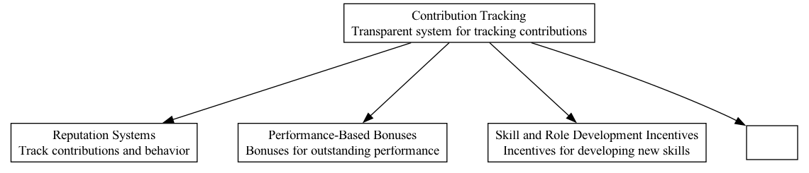

## CTR - Contribution Tracking

### Supports:
[Reputation Systems](./reputation_systems.html), [Performance-Based Bonuses](./performance_based_bonuses.html), [Skill and Role Development Incentives](./skill_and_role_development_incentives.html), [Shares for Sweat](./shares_for_sweat.html)

### Context:
In DAOs, individual contributions often vary vastly in terms of type, time commitment, and impact. Transparent and equitable tracking and rewarding of these contributions are crucial to encourage continued participation and to ensure fairness.

### Problem:
Without a clear system to track individual efforts, contributions might go unrecognized or be inequitably rewarded. This can lead to dissatisfaction amongst contributors, decreased participation, and potential disputes which can undermine the DAO's effectiveness and morale.

### Forces:
- **Equity**: Ensuring that rewards are proportional to the effort and impact of the contributions.
- **Transparency**: Making the process clear and open to all members to audit and verify.
- **Motivation**: Encouraging continued contribution by reliably rewarding efforts.
- **Scalability**: The system should manage a broad range of contributions types and scales as the organization grows.

### Solution:
Implement a decentralized ledger within the DAO's blockchain infrastructure to record all contributions in a tamper-proof manner. Contributions can be logged automatically through integration with project management tools and manually through member submissions verified by peer review. The ledger entries should include timestamps, a description of the contribution, and its estimated value according to predefined criteria.

The DAO should utilize smart contracts to automate the validation, tallying, and reward distribution processes based on the ledger entries. This contract can allocate tokens, reputation points, or other forms of rewards from a predefined reward pool based on the contribution's value. The criteria for what constitutes a rewardable contribution, and how its value is estimated, should be governed by democratic consensus and adjustable through proposal submissions to adapt to evolving needs.

### Therefore:
Integrate comprehensive contribution tracking tools and mechanisms leveraging blockchain's immutability for transparency and smart contract capabilities for automation, ensuring that all contributions are acknowledged and fairly rewarded.

