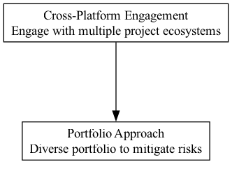

## CPE - Cross-Platform Engagement

### Supports:
[Portfolio Approach](./portfolio_approach.html)

### Context:
DAOs often focus on optimizing resource allocation within a single platform or ecosystem, potentially leading to dependency and reduced exposure to diversified technological advancements and community insights.

### Problem:
Relying heavily on a single platform can expose DAOs to platform-specific risks including regulatory changes, platform stability issues, and shifts in platform governance models, which can affect the DAO's activities and asset values.

### Forces:
- **Platform Dependence Risk**: Over-reliance on one platform can lead to vulnerabilities.
- **Innovation Stagnation**: Limited exposure to diverse technologies and frameworks can hinder innovative capacities.
- **Resource Allocation Efficiency**: Diversifying platforms might increase operational complexity but potentially leads to more robust ecosystems.

### Solution:

Engage with multiple blockchain and technology platforms to diversify dependencies and leverage distinct features from various ecosystems. For DAOs deploying capital via code bounties, grants, and investments, this might involve:

1. **Issuing and Managing Assets on Multiple Chains**:
   - **Example**: A DAO could issue its governance tokens on Ethereum due to its robust smart contract capabilities and broad user base, while also leveraging the low transaction fees of the Internet Computer Chain for micropayment transactions within its ecosystem. This diversifies the DAO’s operational platforms, mitigating risks linked to the operational or regulatory changes within a single blockchain.

2. **Participating in Collaborations or Partnerships Across Different Platforms**:
   - **Example**: MakerDAO has engaged with multiple blockchains and DeFi protocols to ensure that DAI stablecoin is usable across different platforms, increasing its utility and presence in the wider cryptocurrency marketplace. Such cross-platform engagement can extend a DAO’s reach and influence beyond its original platform, engaging with new communities and potential contributors.

3. **Utilizing Cross-chain Technologies to Enable Interoperable Applications and Services**:
   - **Example**: The use of blockchain interoperability protocols such as Polkadot’s parachains or Cosmos’ Inter-Blockchain Communication protocol can help DAOs interact with multiple blockchains in a secure and efficient manner. For example, a DAO that funds environmental projects can utilize different blockchain platforms specific to regions and integrate data through cross-chain technology for better transparency and impact measurement.

4. **Hosting Documents and Governance Discussions on Platform-agnostic Tools**:
   - **Example**: Using tools like Aragon, which allows for the creation and management of decentralized organizations across different blockchains, or DAOstack, which provides scalable frameworks for collective decision-making independent of the underlying blockchain platform. This ensures that the governance processes of a DAO remain accessible and resilient, even if one platform faces downtime or other issues.

### Therefore:
Leverage a cross-platform approach to engage and integrate multiple communities and technologies, reducing reliance on any single platform and broadening exposure to innovations, thereby enhancing the resilience and resourcefulness of the DAO.

