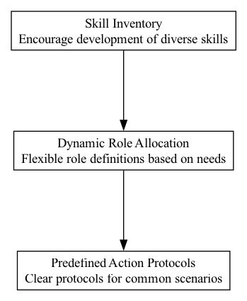

## DRA - Dynamic Role Allocation

### Supports:

[Predefined Action Protocols](./predefined_action_protocols.html)

### Context:

In decentralized environments like DAOs, flexibility and efficiency in role allocation are crucial. Traditional methods, reliant on manual intervention for role assignments and adjustments, can slow down operations and may not optimally align roles with the immediate needs or strategic goals of the organization.

### Problem:

Static role assignments in DAOs can lead to inefficiencies, with poor alignment of member skills and organizational needs. Additionally, manual interventions in role adjustments or replacements can introduce delays and biases, reducing overall operational agility and effectiveness.

### Forces:

- **Responsiveness**: The need for the organization to quickly adapt to changes in strategy or operational conditions.
- **Efficiency**: Maximizing resource allocation without excessive administrative overhead.
- **Fairness and Transparency**: Ensuring that role assignments are perceived as fair and free from manipulative influences.
- **Skill Alignment**: Matching organizational needs with the members' best-suited competencies.

### Solution:

Implement an automated Dynamic Role Allocation system that uses predefined rules and member data to assign roles. Key components of this system include:

- **Automated Role Matching**: Utilize algorithms to analyze member skills, availability, and past performance to automatically suggest role assignments.
- **Role Rebalancing**: Periodically or triggered by specific events (e.g., resignation, project shifts), the system reassesses and reassigns roles to optimize alignment with current needs.
- **Succession Planning**: In case of member resignation, the system automatically proposes the next suitable candidate for the role based on the predefined succession criteria.
- **Transparent Criteria**: Establish and maintain clear, transparent criteria for role assignments that all members can access and understand, minimizing disputes and enhancing credibility.

For instance, in a scenario where a key role becomes suddenly vacant due to a member's resignation, the system can immediately evaluate the member pool and assign a replacement based on previously agreed-upon rules, skills matching, and current availability, thereby minimizing disruptions.

### Therefore:

Embrace an automated Dynamic Role Allocation system to increase responsiveness and efficiency in role assignments, ensuring optimal alignment of roles with member capabilities and organizational needs, while maintaining transparency and fairness in the process.

### Supported By:

[Skill Inventory](./skill_inventory.html)

