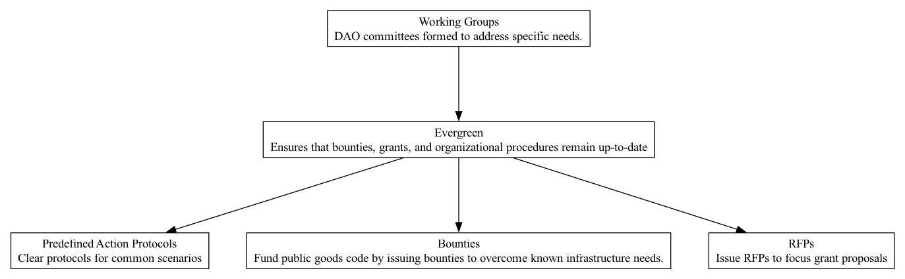

## EVG - Evergreen

### Supports:
[Predefined Action Proposals](./predefined_action_proposals.html), [Bounties](./bounties.html), [RFPs](./rfps.html),

### Context:

The DAO ecosystem is dynamic, with constant shifts in technology, market conditions, and community needs. Staying relevant and effective over time demands that strategies, processes, and projects within DAOs not only start strong but also adapt and evolve.

### Problem:

Many DAOs launch initiatives (like bounties and grants) that become outdated due to rapidly changing technological landscapes and shifting community priorities. This staleness can lead to wasted resources, diminishing impact, and waning community interest and trust.

### Forces:
- **Adaptability vs. Stability**: Balancing the need for projects to be adaptable while maintaining a stable operational strategy.
- **Technological Evolution**: Technologies and best practices evolve, so what was optimal at a project's inception may quickly become obsolete.
- **Community Engagement**: Keeping the community engaged over time requires refreshing and updating initiatives to maintain interest and relevance.
- **Resource Allocation**: Efficiently reallocating resources to the most impactful and contemporary initiatives ensures the maximization of returns and effectiveness.

### Solution:

Implement an 'Evergreen' policy within the DAO's operational framework. This policy mandates regular reviews and updates of bounties, grants, and protocols to align with the latest technological advancements and sector trends. Establish predefined intervals (e.g., annually or biannually) for the reassessment of ongoing projects, and stipulate criteria for such assessments based on technological relevance, community feedback, and impact metrics. Engage working groups dedicated to the continuous monitoring and reporting on trends that could influence project scopes and methods.

### Therefore:

Regularly update and refresh DAO initiatives to stay technologically relevant and highly engaging for the community, ensuring sustained effectiveness and resource optimization.

### Supported By:
[Working Groups](./working_groups.html)

