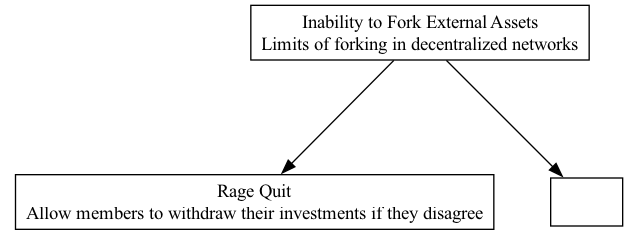

## ITF - Inability to Fork External Assets

### Supports:
[Control as Liability](./control_as_liability.html)
[Rage Quit](./rage_quit.html)

### Context:
In the decentralized ecosystem, forking is commonly used to address disputes or divergent visions within a community by copying the protocol’s code and creating a new, independent version. However, significant limitations arise with decentralized networks, especially concerning external assets which are not as easily duplicated.

### Problem:
Forks in the blockchain context allow communities to resolve disputes or evolve through divergence. However, this process cannot replicate external assets or relationships embedded in the original network. This results in fragmented communities and resources, potentially diminishing the network's overall value and utility.

### Forces:
- **Decentralization:** Ensures no single point of failure and promotes community governance.
- **Asset Exclusivity:** Certain assets or integrations cannot be replicated or split among forks due to legal, technical, or partnership exclusivities.
- **Community Division:** Forks can lead to a split in the community, dividing resources, attention, and development efforts.
- **Value Dilution:** Forking a network can dilute the value of the network and its assets, reducing effectiveness in capital deployment.

### Solution:
When constructing DAO operations and governance structures, consider mechanisms like separating DeFi tokens, used for operational transactions, from governance or staking tokens, which encapsulate voting power and ownership. An instance of this strategy in action is EigenLayer's development of the Eigen token, which separates the utility of asset staking from operational transactions within its network.

### Therefore:
To prevent the detrimental impact of the inability to fork external assets, DAOs should explore structuring their tokens to separate governance from operations. This can safeguard against the loss of network cohesion and asset value, ensuring that even if a community feels the need to fork the protocol, the foundational economic activities remain stable and secure.

