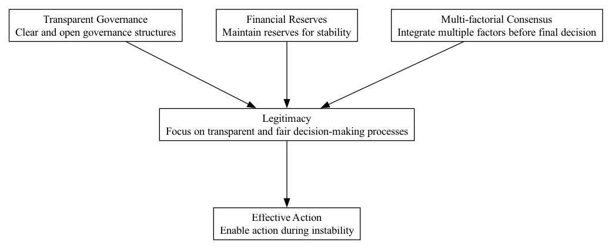

## LGM - Legitimacy

### Supports:

[Effective Action](./effective_action.html)

### Context:

In Decentralized Autonomous Organizations (DAOs), the concept of legitimacy plays a crucial role in gaining member consent and compliance with collective decisions, especially in capital deployment activities like code bounties, grants, and hybrid investments.

### Problem:

Without a strong sense of legitimacy, DAOs can struggle with low engagement, conflict, and resistance to organizational directives, which undermines their capability to effectively execute projects and allocate resources.

### Forces:

- **Trust and Authority:** The perceived rightfulness of DAO governance affects member trust and their willingness to follow decisions.
- **Community Support:** Legitimate processes are more likely to receive broad community support, which is essential for DAOs that rely on active participation.
- **Adaptability:** Legitimate governance frameworks are more adaptable to changes without causing dissent or instability.

### Solution:

To establish and maintain legitimacy within a DAO, implement a multipronged approach:
1. **Transparent Governance:** Utilize blockchain technology to create a transparent record of decisions and actions, which can be audited by any member at any time.
2. **Inclusive Decision-Making:** Engage a broad base of the community in the governance process, ensuring that decisions are made with widespread input and consensus, which reflects the diversity of the community.
3. **Fair Process and Enforcement:** Develop and adhere to fair processes for decision-making. Ensure that the rules are applied consistently and justly across all members.
4. **Performance Validation:** Regularly review and communicate the outcomes and impacts of decisions, validating the success of governance in meeting community goals and adjusting course when necessary.
5. **Continuity and Change Management:** Respect historical decisions while being open to evolutionary changes, balancing tradition with innovation.

By applying these principles, DAOs can foster a robust sense of legitimacy that upholds community trust and participation, thus ensuring compliance and support for strategic decisions.

### Therefore:

Emphasize processes that build and reinforce legitimacy to enhance community engagement, trust, and effective governance in DAO operations.

### Supported By:

[Financial Reserves](./financial_reserves.html), [Transparent Governance](./transparent_governance.html), [Multi-factorial Consensus](./multi_factorial_consensus.html)

