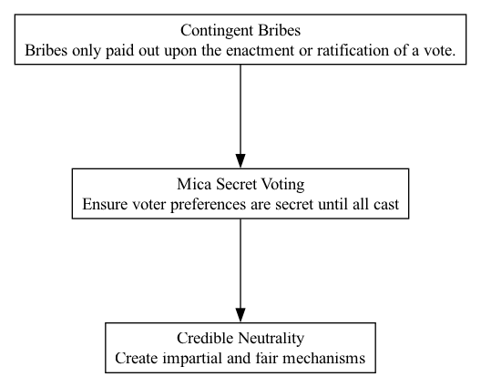

## MSV - Mica Secret Voting

### Supports:
[Credible Neutrality](./credible_neutrality.html)

### Context:
In DAO operations, voting mechanisms are central to decision-making. However, transparency in voting can sometimes lead to unwanted consequences such as vote buying, retaliation, or peer pressure, which can skew the honesty of votes and ultimately affect the neutrality and fairness of decisions.

### Problem:
Traditional public voting methods in DAOs can compromise voter privacy and lead to external influences on voter decisions. This can undermine the integrity of the voting process, where voters might not vote according to their true preferences but rather due to social, financial, or political pressures.

### Forces:
- **Privacy vs. Transparency**: Balancing the need for private voting to protect voter choices with the demand for transparency to ensure fair process.
- **Influence vs. Autonomy**: The tension between external influences (like lobbying and social pressure) and the autonomous, independent decision-making required for DAOs.
- **Security vs. Convenience**: Implementing a secure secret voting system without making the process overly complex or inaccessible to participants.

### Solution:
Implement 'Mica Secret Voting', a cryptographic approach to secret voting involving mechanisms such as zero-knowledge proofs or homomorphic encryption. This method ensures that votes are kept secret, protecting individual voter preferences from being influenced or exposed prematurely. The anonymity of votes eliminates fears of retribution or peer pressure, promoting votes based on honest personal convictions about what is best for the DAO.

The technical implementation could use secure multi-party computation (SMPC) or zero-knowledge succinct non-interactive arguments of knowledge (zk-SNARKs) to create a voting protocol where no single party ever has access to the full details of the votes. This cryptographic solution secures the voting process against both internal and external tampering, providing a verifiable and unbiased tally.

### Therefore:
Adopt Mica Secret Voting within DAOs to ensure that every voter can make decisions privately and securely, enhancing the integrity and credibility of the electoral process within decentralized governance frameworks.

