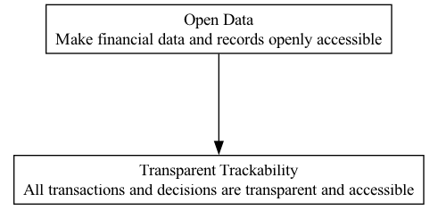

## OD - Open Data

### Supports:
[Transparent Trackability](./transparent_trackability.html)

### Context:
In the landscape of DAOs, data regarding financial transactions, decision-making records, and governance actions are pivotal. These organizations operate on the principles of decentralization and collective management, where every action and decision can significantly impact the distributed network and its stakeholders.

### Problem:
Without a systematic approach to data openness, members may lack access to crucial information, leading to reduced transparency and potential mistrust within the community. This opacity can hinder informed decision-making and limit member engagement and oversight.

### Forces:
1. **Transparency vs. Privacy**: Balancing the need for open access to data with the privacy concerns of individuals involved.
2. **Data Integrity**: Ensuring that the data shared is accurate, tamper-proof, and reflects the true state of affairs.
3. **Accessibility**: Making sure data is easily accessible and understandable to all members, irrespective of their technical expertise.

### Solution:
Implement a system where all financial data including budgets, expenditures, and revenue, as well as records of decisions and governance actions, are published openly. Use blockchain technology to ensure that all entries are tamper-proof and verifiable. This could take the form of a public ledger or a decentralized file system, accessible by all DAO members and potentially the wider public.

To implement effective open data practices:
- **Decentralized Storage**: Use technologies such as IPFS (InterPlanetary File System) or similar decentralized storage solutions to host data.
- **Standardization of Data Formats**: Adopt common standards for data recording and publication to ensure consistency and accessibility. Formats such as JSON or CSV for financial data, and markdown files for meeting minutes or decision records, could be utilized.
- **Real-time Access and APIs**: Provide real-time access through APIs which allows developers to integrate this data into different applications or services, enhancing usability and analysis.

Case studies such as the DAOstack's Alchemy platform and Aragon show successful integration of open data practices, where all proposal submissions, voting records, and financial transactions are visible to all members through a transparent digital interface.

### Therefore:
Adopt and maintain an open data policy that not only reinforces transparency but also builds trust and ensures accountability within the DAO by making all critical data freely available and verifiable.

