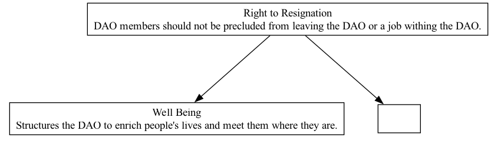

## RTR - Right to Resignation

### Supports:
[Well Being](./well_being.html)
[Levels Of Intensity](./levels_of_intensity.html)

### Context:
In decentralized autonomous organizations (DAOs), where governance and operations are largely distributed and managed through code, the commitment of individual contributors is often variable. Members may join or engage with a DAO based on personal interest, professional alignment, or ideological support, and over time, these alignments or interests may change.

### Problem:
Individual members of a DAO may find themselves in circumstances where continuing their involvement is no longer beneficial or aligned with their personal or professional goals. Without a formal mechanism for resignation, members might be stuck in roles that they are no longer able to fulfill effectively, leading to diminished personal wellbeing and potential underperformance within the DAO.

### Forces:
- **Autonomy vs. Commitment:** Members desire autonomy in their participation, but DAOs need a certain level of commitment to function effectively.
- **Flexibility vs. Responsibility:** While DAOs benefit from flexible participation, responsibilities must be clearly managed to ensure organizational reliability.
- **Attrition vs. Continuity:** Managing member turnover without disrupting ongoing projects or DAO operations is crucial.

### Solution:
Implement a "Right to Resignation" pattern that allows members to formally exit the DAO when they choose, without negative repercussions. This pattern involves creating a clear, codified process within the DAO's smart contracts or governing documents that details:
- The steps a member must follow to resign.
- How to handle ongoing responsibilities and handovers.
- Any necessary notifications to the community or DAO management structures.
  
The process should be automated as much as possible, utilizing smart contracts to manage the transition of responsibilities, access rights, and any financial settlements. Moreover, this pattern should support the assignment of successors, possibly using algorithms to recommend or automatically assign eligible members to vacated roles based on their skills, reputation, and current capacities.

### Therefore:
Implement the Right to Resignation to ensure that DAO members can leave the organization at their discretion, fostering a culture of respect for personal and professional boundaries and contributing to overall member wellbeing.

 
