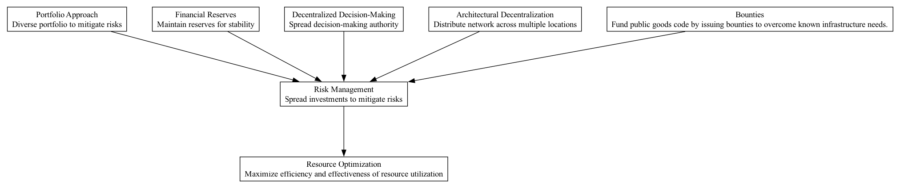

## RSK - Risk Management

### Supports:
[Resource Optimization](./resource_optimization.html)

### Context:
In the DAO environment, the deployment and management of capital in code bounties, grants, and hybrid investments necessitate a prudent approach to managing financial and operational risks. DAOs inherently operate in a highly dynamic and decentralized digital landscape, where volatility in cryptocurrency markets and the mutable nature of technology projects add layers of complexity to risk management.

### Problem:
Capital allocation in DAOs can lead to concentrations of investments in projects that might not yield expected returns or may become obsolete due to rapid technological changes. This could result in significant financial losses and reduced capability to fund future projects.

### Forces:
- **Volatility:** The DAO operates in cryptocurrency ecosystems known for their price volatility, which can dramatically affect the treasury's value.
- **Technological Obsolescence:** Rapid innovation can render decisions based on past data ineffective.
- **Decentralization:** The decentralized nature of DAOs can complicate coordinated risk management strategies.
- **Diverse Stakeholder Expectations:** DAO members may have varying risk appetites and investment horizons.

### Solution:
To manage risk effectively in a DAO, diversify investment across a spectrum of projects. This includes setting thresholds for investment concentrations, using financial instruments like options and futures for hedging, maintaining reserves in stablecoins, or other low-volatility assets, and implementing a decentralized decision-making process to spread risk awareness and responsibility. Regular audits and performance reviews of ongoing projects should be conducted to adjust exposures dynamically. Utilizing blockchain analytics and prediction markets can also provide real-time insights into investment performance and emerging risk factors.

### Therefore:
Adopt a structured and systematic approach to risk management by diversifying investments, utilizing financial hedges, maintaining strategic reserves, and incorporating community-driven decision-making processes to enhance risk assessment and mitigation.

### Supported By:
[Portfolio Approach](./portfolio_approach.html), [Financial Reserves](./financial_reserves.html), [Decentralized Decision-Making](./decentralized_decision_making.html), [Architectural Decentralization](./architectural_decentralization.html), [Inability to Fork External Assets](./inability_to_fork_external_assets.html)

