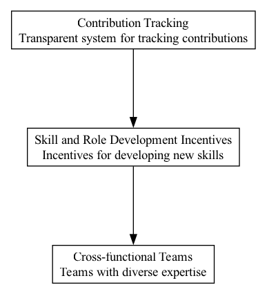

## SRD - Skill and Role Development Incentives

### Supports:

[Portfolio Approach](./portfolio_approach.html)
[Incentive Alignment](./incentive_alignment.html)

### Context:

In rapidly evolving DAO ecosystems, continuously enhancing the skill sets and roles of community members is critical to maintaining competitiveness and adaptability.

### Problem:

DAOs often face challenges in sustaining engagement and encouraging continuous professional growth among their members. Without proper incentives, members may become complacent, contributing to a stagnation in innovation and a decrease in active participation.

### Forces:

- **Skill Atrophy**: Skills not being regularly updated or expanded upon can become obsolete.
- **Engagement**: Continuous engagement requires members to feel incentivized and valued.
- **Adaptability**: The ability of a DAO to adapt to new challenges is dependent on the collective skill set of its members.
- **Resource Allocation**: Balancing resource allocation between immediate project needs and long-term skill development.

### Solution:

Implement mechanisms that award members for acquiring new skills or taking on new roles that contribute to the DAO’s strategic objectives. These incentives can be structured as token bonuses, access to exclusive training sessions, or opportunities for project leadership roles. For example, a DAO could offer token rewards for members who complete specified training modules or successfully lead a project initiative that aligns with the DAO’s goals.

Real-world examples include:
1. **Gitcoin DAO**, which has used hackathons as a platform for skills development and community engagement. Participants are often rewarded with tokens, boosting both their skills and their stake in the DAO’s ecosystem.
2. **MakerDAO** offers a ‘Core Units’ framework where contributors can propose new roles or projects, which, upon approval, receive funding and support, encouraging members to develop roles that directly impact the DAO’s operations.

### Therefore:

Create structured incentive schemes that reward learning and role development, which are crucial for the agility and growth of a DAO.

### Supported By:

[Contribution Tracking](./contribution_tracking.html)

