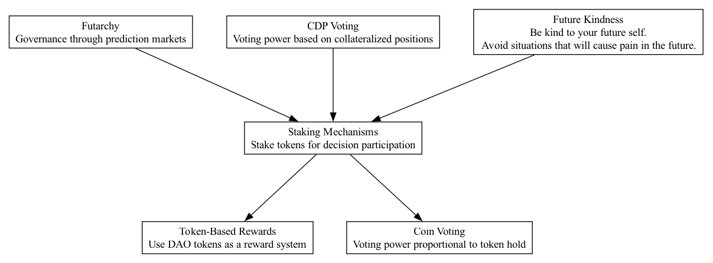

## STM - Staking Mechanisms

### Supports:
[Token-Based Rewards](./token_based_rewards.html), [Coin Voting](./coin_voting.html)

### Context:
In DAOs, ensuring committed and responsible participation is crucial, particularly when decisions impact the allocation and management of substantial capital. Staking mechanisms serve to align participant incentives with the long-term success and health of the ecosystem.

### Problem:
Without a staking mechanism, participants might engage in decision-making that promotes short-term gains at the expense of long-term stability and growth, potentially leading to suboptimal outcomes and reduced trust among members.

### Forces:
- **Commitment vs. Speculation:** Balancing the need for active, long-term participant engagement against short-term speculative behavior.
- **Risk vs. Reward:** Participants must feel that the risks taken by staking tokens are aptly rewarded.
- **Decentralization vs. Security:** Ensuring the DAO remains decentralized while protecting it from malicious actors or uninformed decision-making.

### Solution:
Implement a staking mechanism where participants are required to lock up tokens to engage in voting or decision-making processes. This lock-up period should be extensive enough to discourage short-term speculation and ensure that only those who are genuinely invested in the DAO’s future have a say in critical decisions. The staked tokens could also earn rewards, aligning further with the DAO’s success.

Real-world examples include:
- **Ether2.0:** Where participants stake Ether to become validators, playing a role in network security and governance, thereby incentivizing long-term holding and participation.
- **Internet Computer:** Uses staking in governance decisions where longer staking durations increase voting power, encouraging more thoughtful long-term decision-making amongst token holders.

### Therefore:
Integrate staking mechanisms within DAO operations to ensure that voting power and participation rights are aligned with long-term incentive structures, fostering greater responsibility and reducing speculative behavior.

### Supported By:
[Future Kindness](./future_kindness.html), [CDP Voting](./cdp_voting.html)

