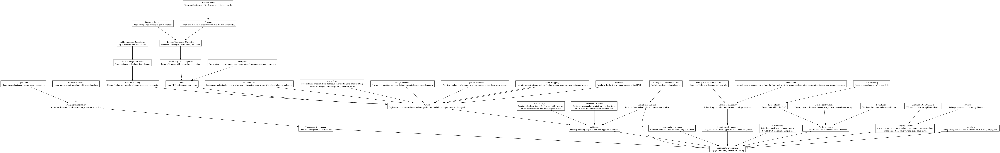
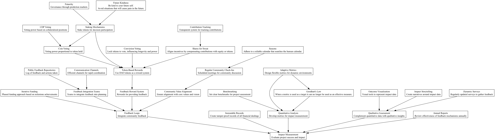

# The Pattern Language

As we move from a broader understanding inspired by Dr. Christopher Alexander's generative approach in architecture to a more structured and practical application within Decentralized Autonomous Organizations (DAOs), we transition our focus towards specific patterns which have been proven conducive in this innovative governance structure.

## From Theory to Practice: Adapting Alexander's Concepts to DAOs

Dr. Christopher Alexander's seminal works, especially "A Pattern Language" and "The Nature of Order," present a nuanced philosophical approach to architectural design; they center on creating spaces that resonate with human beings on a profound level. These frameworks describe the imperatives for building structures that feel alive, those that support human existence beautifully and sustainably. At the core of his philosophy is the focus on "centers" — focal points around which life organically gathers and against which the success of a structure can be metered.

As we adapt these theoretical approaches into DAOs — essentially digital and organizational architectures, the premise remains intact; we seek to embed life into the organizational structures so that every stakeholder engagement or interaction becomes more intuitive, effective, and fulfilling. The DAO ecosystem thrives on a certain fluidity, making it essential that we not only create but constantly adapt and refactor these digital architectures as they evolve.

## The Living Structure of DAOs: Pattern Language Applied

The application of Alexander's pattern language in the realm of DAOs revolves around establishing a repeated and scalable model that enhances the contribution of all participants while adhering to the DAO's ethos. These patterns provide the backbone for interactions, decision-making, and governance that adapt over time to accommodate the ebbs and flows of digital economy and collective human action.

### Flexibility and Adaptation: The Twin Pillars of DAO Patterns

In the frenetic pace of technological change, DAOs face unique challenges and opportunities that physical architecture does not. Patterns in DAO must anticipate rapid evolution and the need for continuous improvements. They must serve as guidelines yet be adaptable enough to morph as new insights and technologies emerge. This is where the life-preserving process of Alexander's work — stepwise refinement — becomes crucial.

### The Initial Set of Patterns

The patterns collected from extensive interviews and discussions within the DAO community form our starting language. These identified patterns range from optimizing resource orchestration to governance transparency and community involvement. Each pattern feeds into a larger tapestry that, collectively, creates a robust system for managing investments, code bounties, and grants within a DAO. 

#### Example of DAO-specific Pattern Application
- **Resource Optimization Pattern**—focuses on the strategic deployment and use of resources through mechanisms like effective actions supported by cross-functional teams and community involvement. 
- **Iterative Funding Pattern**—employs phased capital deployment to ensure project milestones are met prior to additional funding, ensuring robust project vetting and performance-based funding.

### Evolution Through Community Feedback

The patterns, while serving as an initial blueprint, are not set in stone. They are subject to the DAO’s intrinsic mechanism for evolution through community feedback, which reflects Alexander's "life-preserving process." This ensures that changes to patterns are methodical and enhance the overall health of the DAO system. Regular reviews and adaptations help in dropping obsolete patterns, introducing new ones, and tweaking existing ones to better serve the DAO as it scales and diversifies.

## Empowering DAOs Through Dynamic Structural Patterns

As we embed these patterns into the operational fabric of DAOs, we recognize their potential to not only guide current strategies but also to provide a foundational language that supports future modifications and improvements. This living document of patterns will evolve, guided by the collective intelligence and empirical learning from the DAO community, continuously refining the structures supporting decentralized governance. Our aim is not just to create but to nurture, evolve, and perpetuate a system that resonates deeply with all participants, embodying Alexander's vision of enhancing life through thoughtfully designed systems.

# A DAO seeking to promote a community or system is an operation in

* [RO. Resource Optimization](./resource_optimization.html)

through activities such as...

* [IMI. Impact Measurement](./impact_measurement.html)
* [RDS. Resource Development](./resource_development.html)
* [IAL. Incentive Alignment](./incentive_alignment.html)
* [RSK. Risk Management](./risk_management.html)
* [EFA. Effective Action](./effective_action.html)

...where effective action can be optimized through...

* [LGM. Legitimacy](./legitimacy.html)
* [CNL. Credible Neutrality](./credible_neutrality.html)
* [DPI. Democratic Participation Incentives](./democratic_participation_incentives.html)
* [SDM. Scalable Decision-Making](./scalable_decision-making.html)
* [CFT. Cross-functional Teams](./cross-functional_teams.html)

...resulting in...

* [DAU. Decentralized Autonomy](./decentralized_autonomy.html)

...keeping in mind teh concepts of...

* [CAL. Control as a Liability](./control_as_a_liability.html)
* [SUB. Subtraction](./subtraction.html)

...and attracting a community with...

* [TGV. Transparent Governance](./transparent_governance.html)
* [EDO. Educational Outreach](./educational_outreach.html)
* [COM. Community Champions](./community_champions.html)
* [CEL. Celebrations](./celebrations.html)
* [DNB. Dunbar's Number](./dunbars_number.html)
* [WG. Working Groups](./working_groups.html)
* [INF. Infrastructure](./infrastructure.html)
* [INS. Institutions](./institutions.html)

...with infrastructure and institutions developed through...

* [GRA. Grants](./grants.html)
* [BOU. Bounties](./bounties.html)

...supported by...

* [RFP. Requests for Proposals](./requests_for_proposals.html)
* [SCH. Showcase](./showcase.html)
* [GRS. Grant Shopping](./grant_shopping.html)
* [WHP. Whole Process](./whole_process.html)
* [HTM. Harvest Teams](./harvest_teams.html)
* [TPR. Target Professionals](./target_professionals.html)
* [BFB. Bridge Feedback](./bridge_feedback.html)
* [EVG. Evergreen](./evergreen.html)

...and external institutions can be supported with...

* [BDA. Biz Dev Agents](./biz_dev_agents.html)
* [SR. Seconded Resources](./seconded_resources.html)

...decisions are mostly handled by...

* [PAP. Predefined Action Protocols](./predefined_action_protocols.html)

...which get quickly implemented through...

* [DRA. Dynamic Role Allocation](./dynamic_role_allocation.html)
* [GUI. Good UI](./good_ui.html)
* [DAD. Define Affordances/Disaffordances](./define_affordances_disaffordances.html)

...and improving its impact with...

* [FBL. Feedback Loops](./feedback_loops.html)
* [QAN. Quantitative Analysis](./quantitative_analysis.html)
* [QUL. Qualitative Assessment](./qualitative_assessment.html)

...where feedback is encouraged with...

* [IFN. Iterative Funding](./iterative_funding.html)
* [CVA. Community Value Alignment](./community_value_alignment.html)
* [SSS. Stakeholder Synthesis](./stakeholder_synthesis.html)

...deployed during...

* [SNS. Seasons](./seasons.html)

...and...

* [RCC. Regular Community Check-Ins](./regular_community_check-ins.html)
* [FIT. Feedback Integration Teams](./feedback_integration_teams.html)

...fortified by...

* [PFR. Public Feedback Repositories](./public_feedback_repositories.html)
* [FRS. Feedback Reward System](./feedback_reward_system.html)
* [TTT. Transparent Trackability](./transparent_trackability.html)

...with the quantitative support of...

* [BKM. Benchmarking](./benchmarking.html)
* [AMT. Adaptive Metrics](./adaptive_metrics.html)
* [DS. Dynamic Surveys](./dynamic_surveys.html)
* [GLW. Goodhart's Law](./goodharts_law.html)

...and qualitative support of...

* [OVT. Outcome Visualization](./outcome_visualization.html)
* [ITS. Impact Storytelling](./impact_storytelling.html)

...and recorded in...

* [IR. Immutable Records](./immutable_records.html)
* [ARP. Annual Report](./annual_report.html)
* [OD. Open Data](./open_data.html)

To further develop resources use...

* [CFT. Cross-functional Teams](./cross-functional_teams.html)

...defined, modified, and maintained with...

* [JBD. Job Boundaries](./job_boundaries.html)
* [RRO. Role Rotation](./role_rotation.html)
* [CCN. Communication Channels](./communication_channels.html)

...producing...

* [COM. Community Champions](./community_champions.html)

...capable of contributing to...

* [MP. Mentorship Programs](./mentorship_programs.html)

...that build upon the concept of...

* [DNB. Dunbar's Number](./dunbars_number.html)

...managing and developing roles and assignments through...

* [SKI. Skill Inventory](./skill_inventory.html)
* [LDF. Learning and Development Fund](./learning_and_development_fund.html)

Always aligning incentives with...

* [TBR. Token-Based Rewards](./token_based_rewards.html)
* [RPS. Reputation Systems](./reputation_systems.html)
* [PBB. Performance-Based Bonuses](./performance_based_bonuses.html)
* [LPR. Long-Term Participation Rewards](./long_term_participation_rewards.html)
* [DPI. Democratic Participation Incentives](./democratic_participation_incentives.html)
* [SRD. Skill and Role Development Incentives](./skill_and_role_development_incentives.html)

...with concepts such as...

* [STM. Staking Mechanisms](./staking_mechanisms.html)
* [SFS. Shares for Sweat](./shares_for_sweat.html)
* [CTR. Contribution Tracking](./contribution_tracking.html)
* [EMP. Escrow and Milestone Payments](./escrow_and_milestone_payments.html)
* [CTR. Contribution Tracking](./contribution_tracking.html)

Avoid and manage risk for the DAO with...

* [FIR. Financial Reserves](./financial_reserves.html)
* [PA. Portfolio Approach](./portfolio_approach.html)

...where you diversify the DAO across many areas such as...

* [CFT. Cross-functional Teams](./cross-functional_teams.html)
* [CPE. Cross-Platform Engagement](./cross_platform_engagement.html)
* [CDV. Community Diversification](./community_diversification.html)
* [ILB. Innovation Labs](./innovation_labs.html)
* [LDG. Logical Decentralization](./logical_decentralization.html)

...and govern with...

* [DDM. Decentralized Decision-Making](./decentralized_decision-making.html)

...supported by

* [PDE. Political Decentralization](./political_decentralization.html)
* [MFC. Multi-factorial Consensus](./multi_factorial_consensus.html)

...implemented through....

* [CIN. Coin Voting](./coin_voting.html)
* [CIT. Citizen Voting](./citizen_voting.html)
* [CVT. Conviction Voting](./conviction_voting.html)
* [QDV. Quadratic Voting](./quadratic_voting.html)
* [MSV. Mica Secret Voting](./mica_secret_voting.html)
* [FUT. Futarchy](./futarchy.html)
* [CDP. CDP Voting](./cdp_voting.html)

...but protected from...

* [BRB. Bribes](./bribes.html)
* [CBR. Contingent Bribes](./contingent_bribes.html)

Always promoting...

* [WLB. Well Being](./well_being.html)

...through...

* [RQ. Rage Quit](./rage_quit.html)
* [FRV. Frivolity](./frivolity.html)
* [FKD. Future Kindness](./future_kindness.html)
* [RGS. Right Size](./right_size.html)
* [RTR. Right to Resignation](./right_to_resignation.html)
* [LOI. Levels of Intensity](./levels_of_intensity.html)

...keeping in mind...

* [ITF. Inability to Fork External Assets](./inability_to_fork_external_assets.html)

Start Exploring: [Resource Optimization](./resouce_development.html)

Skip to Form Language: [The Form Language](../forms/form_language.html)

Explore the High Level Hierarchies:

