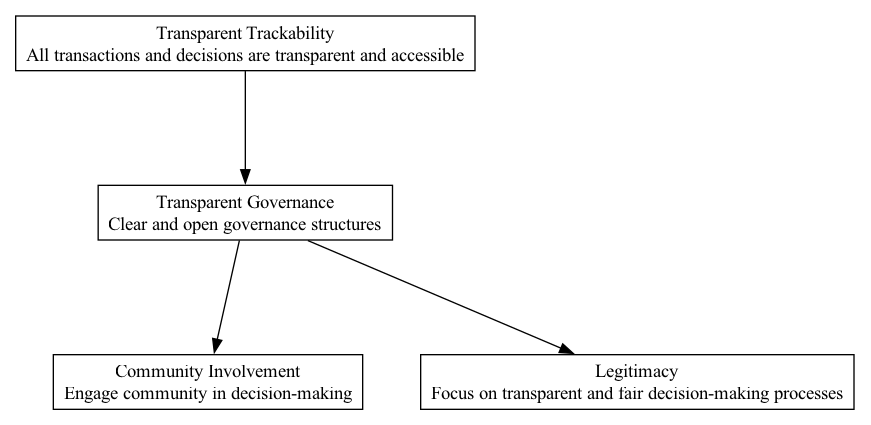

## TGV - Transparent Governance

### Supports:

[Community Involvement](./community_involvement.html), [Legitimacy](./legitimacy.html)

### Context:

In decentralized autonomous organizations (DAOs), governance and decision-making are carried out without centralized control, often through code and member consensus. Given the lack of physical interaction and traditional managerial structures, establishing trust and legitimacy within the community is critical.

### Problem:

In DAOs, the opacity in decision-making processes can lead to mistrust, reduced participation, and challenges in achieving consensus. Members may feel disconnected or skeptical about the governance processes, especially when outcomes conflict with their expectations or interests.

### Forces:

- **Transparency vs. Privacy**: Balancing the need for open governance with individual privacy rights.
- **Scalability vs. Manageability**: Ensuring governance processes are scalable without becoming unwieldy or less transparent as the DAO grows.
- **Security vs. Accessibility**: Keeping governance systems secure from malicious attacks while making them accessible to all members for participation and verification.
  
### Solution:

Implement a governance framework that is fundamentally open, where proposals, decision-making, and financial transactions are recorded on a blockchain or similar immutable ledger. Utilize smart contracts to automate and enforce governance rules transparently. 

Processes to include:
- **Public Proposals Submission**: Allow all members to submit governance proposals in a standardized format that is automatically published to the whole community.
- **Decentralized Voting Systems**: Use blockchain-based voting mechanisms where each vote is traceable and tallied transparently. Consider systems like quadratic voting to balance influence.
- **Open Access to Meeting Records and Discussions**: Record and publish all official meetings, discussions, and the decision rationale on an immutable platform accessible to all members.
- **Audit Trails for Financial Transactions**: Implement systems ensuring that all financial operations (e.g., fund disbursements, budget approvals) are traceable and auditable in real time.

### Therefore:

Design and implement governance systems that not only ensure complete transparency of processes and decisions but also build trust, encouraging broader and more effective community participation.

### Supported By:

[Transparent Trackability](./transparent_trackability.html)

