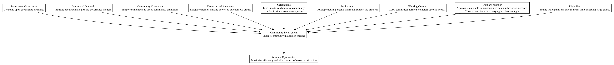

## CIV - Community Involvement

### Supports:
[Resource Optimization](./resource_optimization.html)

### Context:
In DAOs, the distribution of capital through grants, investments, and bounties relies heavily on community trust and active participation. The traditional centralized models of decision-making often do not suffice in these decentralized settings where transparency, inclusivity, and engagement are vital.

### Problem:
DAOs struggle to maintain active participation from their community, leading to decisions that might not reflect the diverse viewpoints and needs of the entire group. This lack of involvement can result in less optimal allocation of resources and waning trust in the decision-making process.

### Forces:
- **Engagement vs. Overload**: Balancing sufficient community involvement with avoiding decision fatigue.
- **Transparency vs. Complexity**: Managing the transparency of processes without overwhelming members with complexity.
- **Scalability vs. Personalization**: Ensuring that involvement strategies scale with the organization, but still allow personal contributions to be valued and recognized.

### Solution:
To foster effective community involvement in DAOs, implement multi-layered participation mechanisms that are both inclusive and practical. This involves setting up decentralized voting systems where members can propose and vote on projects or funding allocations. Additionally, use tools and platforms that facilitate transparent and efficient communication, such as forums, regular community calls, and clear, accessible documentation of decisions and impact.

Engage community members through educational programs that provide them with the necessary knowledge to participate effectively. Formulate clear guidelines and support for community proposals to encourage participation from a diverse set of members, avoiding dominance by a small group.

Real-world examples include:
- **MakerDAO's governance framework**, which employs a robust voting system for decision-making that involves all stakeholders in the governance process. 
- **Dash's treasury system**, which allows community proposals to be voted on by all stakeholders, ensuring that resource allocation is community-driven and aligned with the group's priorities.

### Therefore:
Embrace structures that promote active, informed, and significant community involvement to ensure that resource allocation mirrors the collective intelligence and diverse values of the DAO.

### Supported By:
[Transparent Governance](./transparent_governance.html), [Educational Outreach](./educational_outreach.html), [Community Champions](./community_champions.html), [Decentralized Autonomy](./decentralized_autonomy.html), [Celebrations](./celebrations.html), [Dunbar's Number](./dunbars_number.html), [Working Groups](./working_groups.html), [Institutions](./institutions.html)

