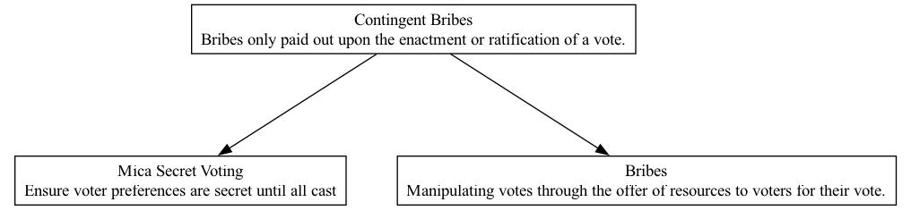

## CBR - Contingent Bribes

### Supports:
[Mica Secret Voting](./mica_secret_voting.html)

### Context:
With the progression towards decentralized governance models in DAOs, ensuring the integrity of the voting process is paramount. In decentralized settings, controls and traditional oversight mechanisms that prevent unethical practices, such as bribing, are often less rigid than in centralized systems.

### Problem:
While Mica Secret Voting enhances privacy and security in voting by concealing the vote choices of individuals until the results are tallied, there remains a vulnerability to contingent bribes — promises of payment made to voters if a specific outcome materializes. Such practices can undermine the fairness and credibility of DAO governance by skewing vote outcomes based on financial incentives rather than honest preference or belief in the best course of action for the organization.

### Forces:
- **Anonymity vs. Accountability**: The need for voter privacy must be balanced with mechanisms to hold voters accountable and deter unethical behavior.
- **Integrity of Decision-Making**: Ensuring that decisions reflect the true consensus of the community rather than the influence of financially motivated actors.
- **Incentive Structures**: Creating systems that reinforce honest participation without making them susceptible to manipulation through contingent bribes.

### Solution:
To guard against the manipulation of votes through contingent bribes, DAOs should implement multi-faceted strategies:
1. **Enhanced Anonymity and Confidentiality in Voting**: Utilize Mica Secret Voting to maintain the secrecy of how individuals voted, thus making it difficult to verify if a voter complied with a bribe agreement based on the vote outcome.
2. **Tracking and Monitoring**: Develop systems to monitor unusual voting patterns or behaviors that might indicate the influence of bribes. Regular audits and analyses can help identify anomalies.
3. **Educational Campaigns**: Inform members about the harmful effects of contingent bribes on the DAO’s governance and encourage ethical participation.
4. **Strict Enforcement and Penalties**: Establish clear rules against contingent bribes, including potential penalties that can deter such behavior. These might include loss of voting rights or membership for confirmed offenders.

### Therefore:
By reinforcing the voting process with both technological solutions and community governance standards, DAOs can reduce the risk and impact of contingent bribes, preserving the integrity and fairness of collective decision-making.

