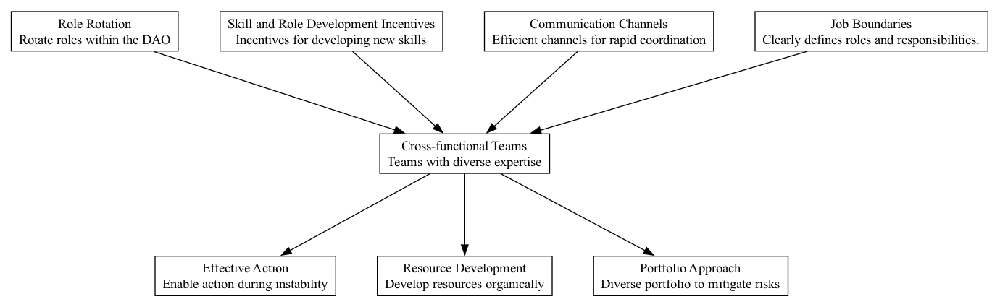

## CFT - Cross-functional Teams

### Supports:

[Resource Optimization](./resource_optimization.html), [Effective Action](./effective_action.html), [Portfolio Approach](./portfolio_approach.html)

### Context:

In a DAO, projects are often complex, requiring a blend of technical knowledge, managerial skills, and community engagement to be successfully executed. Traditional siloed project teams can limit the flow of ideas and dilute accountability, leading to suboptimal outcomes.

### Problem:

DAOs routinely face challenges that are multi-faceted and require diverse skill sets. Projects that lack interdisciplinary inputs may not fully address the underlying needs or opportunities, resulting in inefficiencies, missed targets, or community dissatisfaction.

### Forces:

- **Diversity of Expertise**: Projects benefit from various perspectives; however, integrating these can be complex.
- **Communication Overhead**: Increased interaction among diverse team members can lead to higher communication costs.
- **Resource Allocation**: Balancing the right skills in one team while ensuring other projects are also adequately staffed.
- **Adaptability vs. Stability**: The need for teams that can adapt quickly to changes while maintaining a steady progress towards long-term goals.

### Solution:

Form cross-functional teams within the DAO, composed of members who bring different expertise and backgrounds to the project. These teams should be empowered to make key project decisions and manage resources directly related to their project goals. The diverse make-up of these teams ensures a holistic approach to problem-solving, where technical, financial, and community-driven needs are simultaneously addressed, leading to innovative and comprehensive solutions.

In practice, DAOs like MakerDAO have utilized cross-functional teams to manage different aspects of their ecosystems, such as development, risk assessment, and community engagement, effectively harnessing diverse expertise to boost project outcomes.

### Therefore:

Create teams that integrate various functional expertise, align them with specific projects, and empower them to make decisions that best fit their project's context and goals. Further, maintain fluidity in team composition to adapt to project needs as they evolve.

### Supported By:

[Role Rotation](./role_rotation.html), [Communication Channels](./communication_channels.html), [Job Boundaries](./job_boundaries.html)

