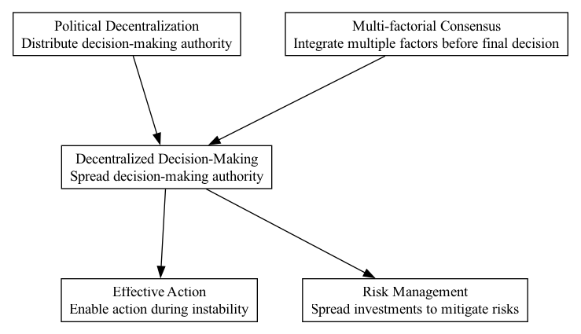

## DDM - Decentralized Decision-Making

### Supports:
[Effective Action](./effective_action.html)  
[Risk Management](./risk_management.html)

### Context:
In a decentralized autonomous organization (DAO), distributing decision-making power is crucial to preventing bottlenecks and fostering an inclusive atmosphere where members feel they truly contribute to and influence the organization's trajectory. Centralized decision-making often results in slow responses to changes and may neglect diverse member insights that could improve project outcomes.

### Problem:
Centralized decision structures in traditional organizations often lead to inefficiencies, decreased member satisfaction, and slow reaction times to environmental changes or internal issues. Moreover, centralized decision-making can undermine the principles of decentralization that many DAOs are built upon.

### Forces:
- **Equality vs. Efficiency**: Balancing democratic participation with efficient decision-making processes.
- **Scalability**: Ensuring the decision-making process remains effective as the organization grows.
- **Transparency**: Maintaining open and verifiable decision-making processes that all members can trust.
- **Speed**: Achieving timely decisions to keep pace with market and internal demands.
- **Resilience**: Avoiding centralized points of failure for robust organizational performance.

### Solution:
Implement structures and mechanisms that spread decision-making across a broader group within the DAO, using technologies like smart contracts to facilitate and record decisions transparently. Techniques include:
1. **Token-based Governance**: Utilizing blockchain tokens allowing members to vote on critical issues based on their stake.
2. **Quadratic Voting**: Reduces power imbalances by scaling the cost of additional votes more than linearly, providing a fairer distribution of voting power.
3. **Liquid Democracy**: Allow delegates to act on behalf of others, passing on their voting rights to trusted members who are more knowledgeable about specific topics.
4. **Consensus Mechanisms**: Employing Multi-factorial Consensus that considers multiple aspects before finalizing decisions, encompassing broader member inputs and environmental variables.

### Therefore:
Integrate decentralized decision-making protocols that align with the democratic ethos of DAOs, enhancing member involvement, satisfaction, and organizational agility.

### Supported By:
[Political Decentralization](./political_decentralization.html)  
[Multi-factorial Consensus](./multi_factorial_consensus.html)

