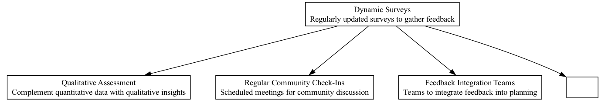

## DYS - Dynamic Surveys

### Supports:

[Regular Community Check-Ins](./regular_community_check_ins.html)   
[Quantitative Assessment](./quantitative_assessment.html)   
[Qualitative Assessment](./qualitative_assessment.html)   
[Feedback Integration Teams](./feedback_integration_teams.html)  

### Context:

In DAOs, maintaining an understanding of community sentiment and reaction to ongoing projects and policies is crucial for adaptive and responsive governance.

### Problem:

Traditional surveys and feedback mechanisms are static and may not capture evolving community sentiments or detailed feedback on specific issues over time, potentially leading to misalignment between the DAO's actions and the community's needs and values.

### Forces:

- **Adaptability:** Surveys need to evolve with the community's changing attitudes and concerns.
- **Granularity:** Feedback must be detailed enough to provide actionable insights.
- **Engagement:** Maintaining community involvement through active participation in feedback mechanisms.
- **Scalability:** Mechanisms must handle feedback at scale without losing individual granularity.
- **Transparency:** Responses and analytics should be open to encourage trust and verifiability in the process.

### Solution:

Implement dynamic surveys within DAOs that update and evolve over time based on previous responses, current events, and emerging trends within the community. These surveys are regularly distributed to capture timely feedback and are designed with adaptive questioning techniques, such as branching paths that delve deeper based on a participant’s previous answers. The use of blockchain technology ensures that each response is recorded transparently, adding to the trustworthiness of the process. Integration with DAO-tailored analytics platforms allows for real-time sentiment analysis and trend identification, enabling swift and informed decision-making.

### Therefore:

Utilize dynamic surveys to frequently and accurately gauge community sentiment, ensuring that the DAO remains closely aligned with its members' evolving perspectives and priorities. Implement adaptive and transparent mechanisms that allow for real-time feedback analysis and responsiveness to community input.

