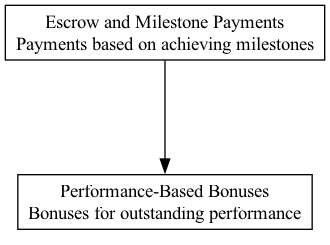

## EMP - Escrow and Milestone Payments

### Supports:
[Performance-Based Bonuses](./performance_based_bonuses.html)

### Context:
In DAO operations, particularly those related to project funding and capital deployment through code bounties, grants, and investments, ensuring that funds are used effectively and that projects meet their objectives is paramount. There is a growing need for mechanisms that boost accountability and enhance the predictability of investment returns.

### Problem:
Projects funded by DAOs may fail to deliver promised results, leading to wasted resources and disillusionment among stakeholders. Traditional upfront funding models do not adequately incentivize project completion or quality, leading to increased risks in investment.

### Forces:
- **Accountability**: Maintaining high levels of accountability in decentralized settings without centralized control.
- **Risk mitigation**: Reducing the risk of project non-completion or subpar performance.
- **Resource optimization**: Ensuring that the limited resources of a DAO are utilized effectively.
- **Incentive alignment**: Aligning the incentives of project teams with the broader goals of the DAO.

### Solution:
Integrate an escrow and milestone payment system within DAO funding mechanisms. Under this system, funds are held in escrow and released only upon the achievement of predefined milestones. This approach can be implemented using smart contracts that programmatically disburse payments when certain criteria are met, ensuring objectivity and reducing disputes.

This pattern not only secures the DAO’s capital but also incentivizes project teams to adhere to their roadmap and maintain high standards of quality. For instance, a DAO can set up a smart contract that disburses 20% of the total funds after the completion of each of five milestones, with each milestone representing a significant phase of the project, such as development, testing, launch, and two post-launch reviews.

### Therefore:
Use the escrow and milestone payment system to structure payment schedules around significant, verifiable project milestones. This approach balances risk and rewards effectively, fostering a culture of accountability and performance.

