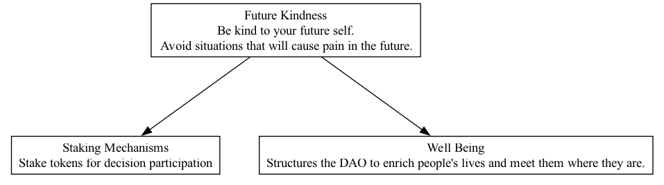

## FKD - Future Kindness

### Supports:
[Staking Mechanisms](./staking_mechanisms.html), [Well Being](./well_being.html)

### Context:
In DAO operations, the decisions made today have lingering effects on the future health and functionality of the organization. When DAO members make commitments, especially those involving finances or reputation, the implications often extend far into the future.

### Problem:
DAOs often implement mechanisms that bind members and their resources for long periods as a way to ensure commitment and long-term planning. These mechanisms, while useful for maintaining stability and consistency, can create inflexible conditions that fail to accommodate the changing personal circumstances and priorities of DAO members.

### Forces:
- **Commitment vs. Flexibility:** While long-term commitment is essential for stability, too much rigidity can deter participation or contribute to decision-making that doesn't adapt to changing conditions.
- **Future Proofing vs. Present Responsiveness:** Striking a balance between making decisions beneficial for the future while still being responsive to present needs and opportunities.
- **Individual vs. Collective Needs:** Members' personal needs or situations may change, requiring more flexibility than the system currently allows.

### Solution:
Implement 'Future Kindness' strategies that include protective measures for members who may need to exit or adapt their commitments without significant penalties. This could involve:
1. **Reversible Staking:** Provide options for reversing staked claims after a cooling-off period, allowing members to reassess their commitments without facing immediate penalties.
2. **Emergency Withdrawals:** Establish conditions under which members can perform emergency withdrawals for a portion of their assets, with clear guidelines to prevent abuse.
3. **Dynamic Commitment Models:** Utilize smart contracts to allow for dynamic adjustments of members' commitments based on predefined personal or market conditions.
4. **Decommitment Rewards:** Offer incentives or lesser penalties for early decommitment if performed responsibly and with enough notice to the DAO to realign resources.

### Therefore:
Implement structures within DAOs that allow for adjusted commitments while ensuring that these mechanisms do not undermine the overall stability and long-term goals of the organization. This includes providing clear, accessible options for members to safely and responsibly modify their involvement according to changes in their personal circumstances or in market conditions.

