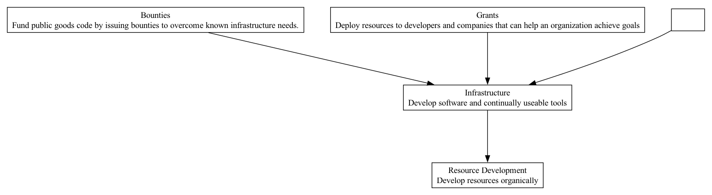

## INF - Infrastructure

### Supports:

[Resource Development](./resource_development.html)

### Context:

Decentralized Autonomous Organizations (DAOs) are established to foster open innovation and collective governance in managing resources and directing developments, specifically in sectors like technology, research, and social initiatives. An effective DAO not only optimizes its internal processes but more critically catalyzes the development of public good infrastructure that serves a broader ecosystem.

### Problem:

DAOs often face the cyclical challenge of funding redundant initiatives due to a lack of awareness and accessibility to existing solutions and frameworks. This inefficiency leads to dispersed efforts that fail to capitalize on the compounded benefits of shared, scalable public infrastructure.

### Forces:

- **Duplication of Efforts:** Without a consolidated infrastructure repository, duplicated efforts increase, draining valuable resources.
- **Access to Utilities:** A lack of easy access to existing tools and frameworks hinders innovation and slows down project delivery.
- **Collaborative Synergies:** Underutilized potential for synergistic developments that can arise from leveraging communal resources.

### Solution:

To counteract inefficiencies and enhance collaborative potential, DAOs should focus on funding, developing, and maintaining public good infrastructure that is universally accessible and beneficial. This involves:

1. **Funding Open Source Projects:** Allocate resources to projects committed to open source principles, ensuring that the developed infrastructure is accessible to all, promotes reuse, and prevents redundancy.
2. **Creating a Central Repository:** Establish a well-maintained and easily accessible repository of tools, frameworks, and resources developed under the DAO’s initiatives, encouraging reuse and further development.
3. **Educational Outreach:** Implement programs that educate current and future project teams about available resources, maximizing the utilization of existing infrastructures.
4. **Integration and Standardization:** Promote the development of interoperable systems that can integrate with existing and future tools, reducing the friction in adopting new technologies.
5. **Sustainability and Maintenance:** Ensure ongoing support and updates for developed infrastructures, preserving their relevance and utility over time.

### Therefore:

Invest in and nurture the development of shared public infrastructure within the broader ecosystem that the DAO operates in. This supports sustainable, efficient, and collaborative growth across communities, preventing redundancy and fostering innovation.

### Supported By:

[Grants](./grants.html), [Bounties](./bounties.html), [Innovation Labs](./innovation_labs.html)

