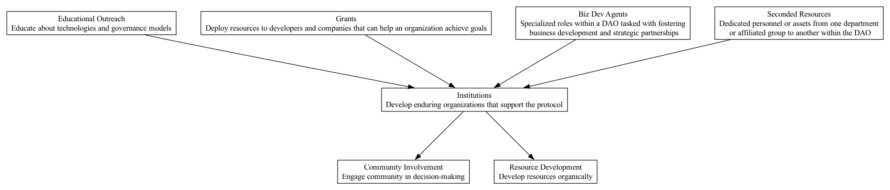

## INS - Institutions

### Supports:
[Resource Development](./resource_development.html), [Community Involvement](./community_involvement.html)

### Context:
Decentralized Autonomous Organizations (DAOs) often operate in fluid and dynamic environments that require not just innovative technology but also strong, adaptive governance structures. Institutions within a DAO refer to the foundational systems and frameworks that sustain governance, operational effectiveness, and long-term strategic achievement.

### Problem:
A persistent challenge in DAOs is ensuring sustainable, effective, and agile governance that resonates with the decentralized nature of the organization while supporting its growth and adaptation to new challenges and opportunities.

### Forces:
- **Trust and Legitimacy:** Institutions must garner trust and be perceived as legitimate by the DAO community to be effective.
- **Adaptability vs. Stability:** While needing to be stable and reliable, institutions also must be flexible enough to evolve with the DAO and its environment.
- **Decentralization:** Maintaining a balance between decentralized governance and effective management and coordination is crucial.
- **Complexity:** As DAOs grow, the complexity of managing resources, initiatives, and community engagement increases.

### Solution:
Develop robust institutions within the DAO that provide clear, transparent, and consistent governance and management frameworks. These institutions should embody the principles of decentralized governance but be designed in a way that they are equipped to handle complexity and scale.

Institutions in DAOs should include frameworks for:
- **Transparent decision-making processes** that are understandable and accessible to all members of the DAO.
- **Formal governance structures**, such as councils or committees, that are elected through community voting to represent their interests and execute administrative tasks.
- **Standardized processes** for common tasks and decisions to reduce overhead and increase efficiency.
- **Regular audits and checks** to ensure compliance with the DAO's rules and ethics, maintaining trust and legitimacy.

Real-world examples include MakerDAO's governance framework, which involves community-elected governance facilitators who coordinate tasks and manage community polls and executive votes. This structure allows for decentralized decision-making while ensuring effective action and administration.

#### Extra-Governance and Meta Institutions

Within the framework of DAOs, a significant focus is typically placed on formal governance structures and decision-making processes. However, the cohesion and long-term sustainability of these organizations can significantly benefit from the establishment of extra-governance and meta institutions. These are mechanisms and traditions that transcend formal governance and help in knitting the community together, building camaraderie, and fostering a shared sense of purpose.

Meta institutions within a DAO might include:
- **Annual Conferences and Gatherings:** These events bring members together from different geographies to share ideas, celebrate achievements, and plan for the future. For example, the Ethereum community organizes Devcon, which serves not only as an educational and developmental platform but also as a cultural meet-up that strengthens community bonds.
- **Recurring Online Summits:** Regularly scheduled virtual events that allow members to engage with and learn from one another can maintain engagement and stimulate collaboration across the DAO. These virtual gatherings are crucial, especially when geographic dispersion is vast.
- **Special Interest Groups (SIGs) and Working Groups:** Formed around specific topics or projects, these groups drive deeper engagement among members with shared interests, contributing to the DAO's culture and output.

These social structures play a critical role in driving a DAO’s culture and can significantly impact its effectiveness and resilience against external pressures. They foster a sense of belonging and loyalty, which are crucial for voluntary organizations where turnover can be high and engagement can be challenging to maintain.

Instituting such meta governance practices not only enhances the social fabric of a DAO but also reinforces its governance mechanisms by promoting a unified approach to the DAO’s mission and value perception among its members. These institutions act as essential support structures, particularly in times of contention or governance reform, providing a continuity that helps preserve institutional memory and cultural identity.

### Therefore:
Establish and continually evolve institutions within the DAO to ensure they provide a stable yet flexible framework to support governance and operational effectiveness, balancing decentralization with the need for effective coordination and management.

### Supported By:
[Grants](./grants.html), [Biz Dev Agents](./biz_dev_agents.html), [Seconded Resources](./seconded_resources.html), [Educational Outreach](./educational_outreach.html)

