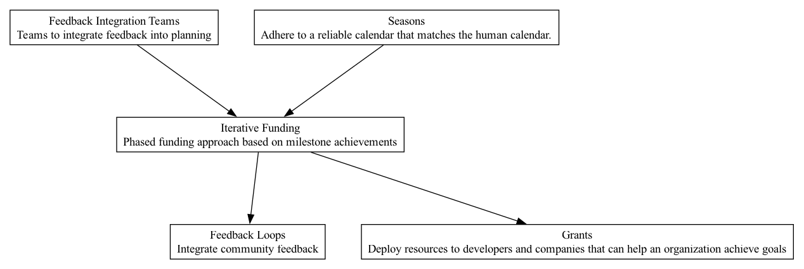

## IFN - Iterative Funding

### Supports:
[Feedback Loops](./feedback_loops.html)

### Context:
In a DAO ecosystem where capital allocation and project funding are critical, a mechanism is needed to ensure efficient use of resources, prevent capital drainage, and motivate perpetual project progress.

### Problem:
Traditional funding approaches can lead to resource misallocation where projects that do not meet expectations continue to receive funding. There's also a risk of stalled progress after initial capital injection.

### Forces:
- **Accountability**: Projects must demonstrate progress to maintain trust and continue receiving support.
- **Efficiency**: Funds should be used optimally, avoiding wastage on underperforming projects.
- **Motivation**: Continuous funding should motivate consistent effort and progress.
- **Adaptability**: Funding models should adapt based on project performance and evolving conditions.

### Solution:
Adopt an Iterative Funding model where projects receive capital in phases which are contingent upon achieving predetermined, verifiable milestones. Starting with a seed phase, initial funding is provided. Subsequent funding rounds should only disburse upon successful milestone completion, evaluated through clear, predetermined criteria.

### Implementation Steps & Techniques:
1. **Set Clear Milestones**: Define specific, measurable, achievable, relevant, and time-bound (SMART) milestones for each phase of the project.
2. **Use an Escrow System**: Leverage smart contracts to hold funds in escrow, releasing them only upon milestone completion.
3. **Regular Review and Audits**: Setup scheduled reviews and audits to ensure milestones are met before releasing the next round of funding.
4. **Feedback Integration**: After each phase, collect and integrate feedback to refine the milestones and funding needs of subsequent phases.

### Real-World Examples:
- **The Ethereum Foundation**: Uses a phased funding approach for its grants, disbursing funds based on completed milestones and demonstrated success.
- **MolochDAO**: Employs a grants system where continuation of funding is contingent upon showing evidence of progress.
- **Dash DAO**: Utilizes a proposal system where the network votes to fund new projects in stages based on demonstrable outcomes.

### Therefore:
Iterative Funding should be implemented as a core financial governance mechanism within DAOs to enhance capital efficiency, ensure project accountability, motivate continuous progress, and adapt funding to real-world results and feedback.

### Supported By:
[Seasons](./seasons.html), [Feedback Integration Teams](./feedback_integration_teams.html)

