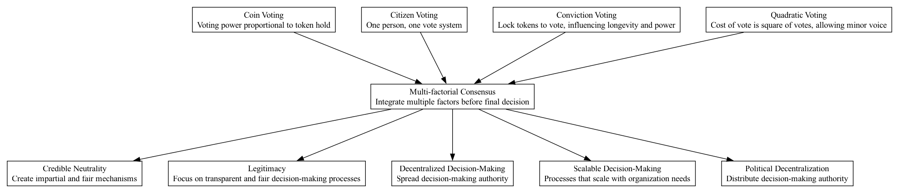

## MFC - Multi-factorial Consensus

### Supports:

[Scalable Decision-Making](./scalable_decision_making.html)  
[Credible Neutrality](./credible_neutrality.html)  
[Legitimacy](./legitimacy.html)  
[Decentralized Decision-Making](./decentralized_decision_making.html)  
[Political Decentralization](./political_decentralization.html)

### Context:

In the governance of Decentralized Autonomous Organizations (DAOs), achieving a fair, transparent, and efficient consensus is crucial. Traditional central governance models are challenged by decentralized paradigms where no single individual or group holds unilateral decision-making power.

### Problem:

Traditional single-factor decision-making systems in DAOs often lead to outcomes that may not reflect the broader community's interests. They are susceptible to manipulation by a majority stakeholder or a small, influential group, potentially undermining the organization's credibility and trust.

### Forces:

- **Representation:** All community voices need representation in the decision-making process to ensure widespread acceptance and legitimacy.
- **Fairness:** Preventing any single entity or group from dominating the agenda is crucial for long-term sustainability.
- **Efficiency:** Decision-making processes must not only be fair and comprehensive but also efficient to prevent governance gridlock.
- **Transparency:** The mechanisms of decision-making should be visible and understandable to all DAO members to build trust and verify integrity.

### Solution:

Integrate multiple voting and consensus mechanisms to distribute decision-making power within a DAO. This creates a system where several checks and balances moderate each other, increasing the robustness of decisions. Techniques such as Coin Voting, Citizen Voting, Commitment Voting, and Quadratic Voting can be used in tandem to ensure that diverse aspects such as stake size, individual participation, commitment duration, and minority protection are all factored into the decision-making process.

**Case Studies:**
1. **DAOstack's Genesis DAO** employed holographic consensus to balance the influence between an absolute majority and passionate minorities, ensuring dynamic and efficient decision-making.
2. **Aragon** uses multi-factor voting systems that combine token-based voting with delegated voting to increase participation rates and mitigate the risks of low voter turnout.
   
These real-world implementations show that blending multiple decision mechanisms enhances DAO governance by aligning it more closely with broad-based support and engagement, lowering risks of manipulation or disenfranchisement.

### Therefore:

Adopt a Multi-factorial Consensus approach that employs various voting methodologies tailored to specific types of decisions, promoting a balanced and comprehensive governance model.

### Supported By:
[Coin Voting](./coin_voting.html)  
[Citizen Voting](./citizen_voting.html)  
[Commitment Voting](./commitment_voting.html)  
[Quadratic Voting](./quadratic_voting.html)

